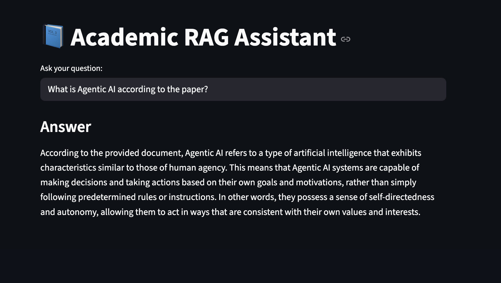

# Academic RAG Assistant using Ollama + Llama 3

An LLM-powered Academic Paper Question Answering System built using:

- Python
- LangChain
- Ollama
- Llama 3
- ChromaDB
- Streamlit

This project allows users to upload or analyse an academic research paper and ask questions based only on the content of the document using Retrieval-Augmented Generation (RAG).

---

# Features

- Academic Paper Question Answering
- Retrieval-Augmented Generation (RAG)
- Local LLM using Ollama + Llama 3
- Semantic Search with ChromaDB
- CLI-based interaction
- Streamlit UI support
- Persistent Vector Database
- No external knowledge usage

---

# System Architecture

```text
PDF Document
      ↓
Text Chunking
      ↓
Embeddings Generation
      ↓
ChromaDB Vector Storage
      ↓
Retriever
      ↓
Llama 3 via Ollama
      ↓
Final Answer
```

---

# Technologies Used

| Technology | Purpose |
|---|---|
| Python | Backend Development |
| LangChain | RAG Pipeline |
| Ollama | Local LLM Hosting |
| Llama 3 | Question Answering Model |
| ChromaDB | Vector Database |
| Streamlit | User Interface |
| PyPDF | PDF Processing |

---

# Installation Guide

## 1. Clone Repository

```bash
git clone git@github.com:Zeeshanch124/Academic-RAG-Assistant.git

cd Academic-RAG-Assistant
```

---

# 2. Create Virtual Environment

## macOS/Linux

```bash
python3 -m venv venv

source venv/bin/activate
```

## Windows

```bash
python -m venv venv

venv\Scripts\activate
```

---

# 3. Install Dependencies

```bash
pip install -r requirements.txt
```

---

# 4. Install Ollama

Download Ollama from:

https://ollama.com

---

# 5. Pull Llama 3 Model

```bash
ollama pull llama3
```

---

# 6. Start Ollama Server

```bash
ollama serve
```

Keep this terminal running.

---

# Running the Application

# Option 1 — Streamlit UI

Run:

```bash
streamlit run ui.py
```

The application will open in your browser automatically.

---

# Option 2 — CLI Application

Run:

```bash
python app.py
```

Example:

```text
Ask: What is Agentic AI according to the paper?
```

---


# Example Questions

You can ask questions such as:

```text
What is Agentic AI according to the paper?

How do LLMs support Agentic AI systems?

What challenges are associated with Agentic AI?

What privacy concerns are discussed in the paper?

What future research directions are mentioned?
```

---

# Project Structure

```text
Academic-RAG-Assistant/
│
├── app.py
├── ui.py
├── cli_paper.pdf
├── requirements.txt
├── README.md
├── vector_db/
├── screenshots/
└── Dockerfile
```

---

# How the System Works

1. The PDF paper is loaded using PyPDFLoader
2. The text is divided into chunks
3. Embeddings are generated using Ollama embeddings
4. Chunks are stored in ChromaDB
5. User asks a question
6. Relevant chunks are retrieved semantically
7. Llama 3 generates an answer using only retrieved context

---

# Retrieval-Augmented Generation (RAG)

This project uses RAG to ensure the model answers only from the provided academic paper.

The system:
- Retrieves relevant document chunks
- Passes retrieved context to the LLM
- Restricts the model from using external knowledge

---

# Persistent Vector Database

Embeddings are stored locally inside:

```text
vector_db/
```

This avoids regenerating embeddings every time the application runs.

---
 
# Screenshots
 
## Streamlit UI Demo

Add screenshot here.


---
 